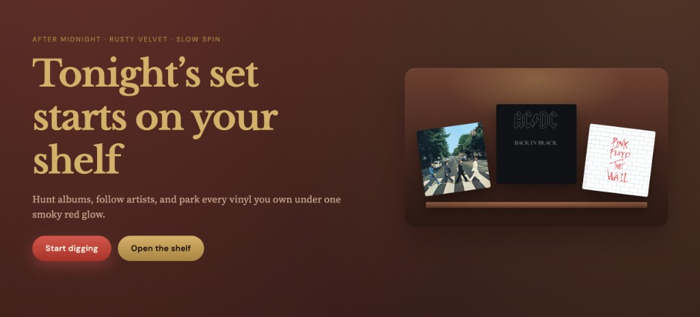
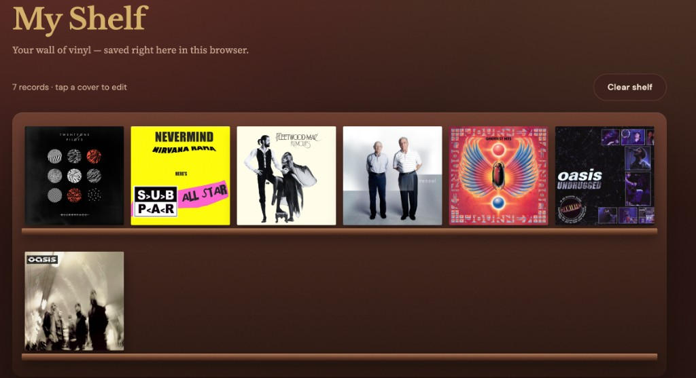

# shelf

Vinyl collection app. Browse albums and artists, save records to your shelf.

- **Live site:** https://myshelfs.netlify.app/
- **GitHub:** https://github.com/lizajean23/myShelf

## Screenshots

### Home


### My Shelf


## Requirements

- [Node.js](https://nodejs.org/) 18 or newer
- npm (comes with Node.js)

## How to run locally

```bash
# 1. Go to the project folder
cd myShelf

# 2. Install dependencies
npm install

# 3. Start the development server
npm run dev
```

Then open in your browser:

**http://localhost:5173/**

If port 5173 is busy, Vite will show another port in the terminal (for example `http://localhost:5174/`). Use that URL instead.

### Stop the server

In the terminal press `Ctrl + C`.

## Other commands

```bash
# Production build
npm run build

# Preview the production build locally
npm run preview
```

`npm run preview` usually opens **http://localhost:4173/**

## Pages

| Page | Path | Description |
|------|------|-------------|
| Home | `/` | Featured albums and artists |
| Explore | `/explore` | Search albums and artists |
| My Shelf | `/shelf` | Your saved vinyl (localStorage) |
| Album | `/album/:id` | Album details and tracklist |
| Artist | `/artist/:id` | Artist and their albums |

## Tech stack

- React 19 + TypeScript
- Vite
- React Router
- React Hooks + Context
- Axios (iTunes Search API)
- Sass / SCSS
- Framer Motion (animations + modals)
- localStorage + sessionStorage
- Dark / Light theme

## Project structure

```
src/
  api/           API client and types
  components/    UI components
  context/       Theme, shelf, profile
  data/          Featured albums list
  hooks/         Custom hooks
  pages/         Route pages
  styles/        SCSS
  copy.ts        UI text
docs/screenshots/
```

## Storage

| Key | Storage | Purpose |
|-----|---------|---------|
| `shelf_vinyls` | localStorage | Saved vinyl |
| `shelf_theme` | localStorage | Theme |
| `shelf_profile` | localStorage | Profile name and avatar |
| `shelf_recent_searches` | sessionStorage | Recent searches |
| `shelf_last_browsed` | sessionStorage | Recently opened albums |

## Featured albums

Home page albums are listed in `src/data/featured.ts`. Edit that file to change which albums appear first.

## Links

- **Live site:** https://myshelfs.netlify.app/
- **Source code:** https://github.com/lizajean23/myShelf

